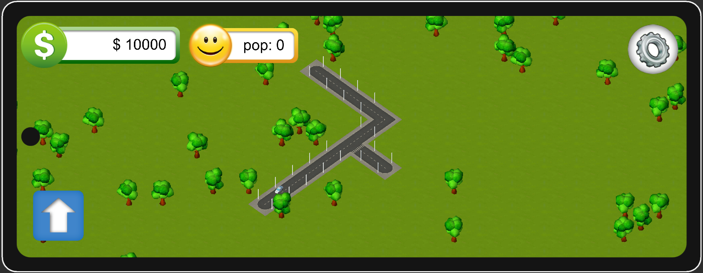

<div align="center">
MichelCity
 </div>
<div align="center">

  
</div>

---

MichelCity é um jogo de simulação de cidade (city builder), inspirado em clássicos como SimCity, desenvolvido em Unity. O objetivo é oferecer ao jogador a experiência de construir, expandir e administrar uma cidade, posicionando ruas, prédios, carros, árvores e outros elementos urbanos em um ambiente totalmente personalizável e expansível.

## 🎮 Visão Geral

- **Gênero:** Simulação, Estratégia, City Builder
- **Plataforma:** Unity (compatível com PC e Mobile)
- **Recursos:** Sistema de grid, gerenciamento de assets, cenas separadas para menu e gameplay, base para integração com sistemas econômicos e de trânsito.
- **Inspiração:** SimCity, Cities: Skylines

---

## 🚀 Como rodar o projeto

1. **Pré-requisitos**
   - Unity 6000.0.31f1 ou superior (recomenda-se sempre a última LTS)
   - .NET SDK se for compilar para mobile/standalone
   - (Opcional) Android SDK, Xcode se for exportar para mobile

2. **Clonando o repositório**
   ```sh
   git clone https://github.com/michelbr84/MichelCity.git

3. **Abrindo no Unity**

   * Abra o Unity Hub.
   * Clique em "Add" e selecione a pasta do projeto.
   * Abra a cena `Assets/_Scenes/MainScene.unity` para iniciar o gameplay principal ou `Assets/_Scenes/MenuScene.unity` para o menu inicial.

---

## 📂 Estrutura do Projeto

```
MichelCity/
  Assets/
    Animations/
    Audio/
    Fonts/
    InputSystem_Actions.inputactions
    Materials/
    Models/
    Plugins/
    Resources/
    Scenes/
    Scripts/
    Settings/
    Sprites/
    _Scenes/
  ProjectSettings/
  Packages/
  README.md
  ...
```

* **Assets:** Onde estão todos os recursos do jogo (scripts, cenas, modelos, áudios, materiais, etc).
* **Scenes / \_Scenes:** Cenas principais do jogo.
* **Scripts:** Código-fonte do gameplay, sistemas auxiliares e utilitários.
* **Models, Materials, Sprites:** Assets gráficos e visuais.
* **Audio:** Efeitos sonoros e músicas.
* **Plugins:** Integrações e dependências de terceiros.
* **InputSystem\_Actions.inputactions:** Novo sistema de Input da Unity.

---

## ⚙️ Principais Sistemas

* **GameManager:** Controla dados globais, grid/matriz da cidade, e assets principais.
* **GameModel:** Gerencia os modelos/instâncias de assets do jogo.
* **Sistema de Grid:** Toda a cidade é baseada em uma matriz, facilitando construção, expansão e validação.
* **Prefabs Personalizáveis:** Rua, prédio, árvore, carros, etc.
* **Menu e Cena Principal:** Organização pronta para fluxo de menu → gameplay.

---

## 📈 Próximos Passos e Ideias

* Implementar sistema de economia e gerenciamento financeiro.
* Adicionar mais tipos de prédios e zonas (residencial, comercial, industrial).
* Sistema de missões/desafios e conquistas.
* Simulação de trânsito e fluxo de veículos.
* Versão mobile com integração de anúncios ou leaderboard.
* Traduzir e documentar todo o projeto (README, código-fonte, comentários).
* Melhorar o menu e UI do jogo.

---


## 📄 Licença

Este projeto está licenciado sob a licença MIT. Consulte o arquivo [LICENSE](LICENSE) para mais detalhes.

---

## 📝 To Do List

* [x] Estrutura básica de grid/matriz
* [x] Sistema de gerenciamento global (GameManager)
* [x] Prefabs iniciais de ruas, carros, árvores e prédios
* [x] Implementação do novo sistema de Input
* [x] Separação de cenas (menu e jogo principal)
* [ ] Sistema de economia e missões
* [ ] Interface de usuário aprimorada
* [ ] Otimização para mobile
* [ ] Documentação detalhada do código
* [ ] Tradução para inglês e outros idiomas

---

<div align="center">
  Feito com ❤️ por Michel
</div>